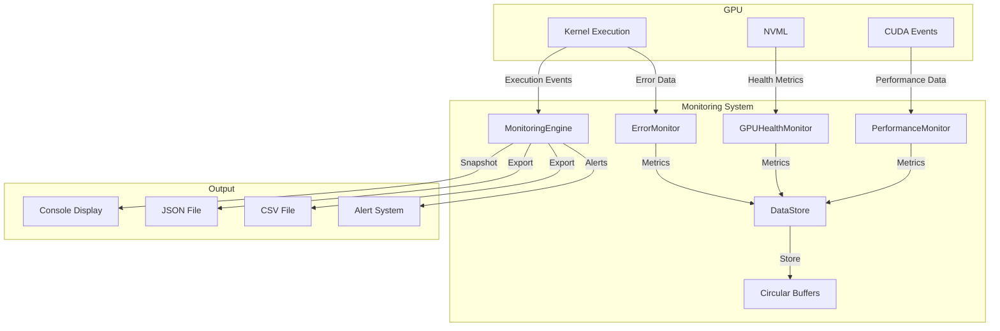

# GPU Burn Monitoring System Architecture

## Overview

The monitoring system provides real-time performance tracking, GPU health monitoring, error detection, and historical data collection for the GPU burn testing tool. It follows the established patterns from the validation engine while maintaining minimal performance impact.

## Core Architecture Principles

1. **Modular Design**: Following the ValidationEngine pattern with pluggable monitoring components
2. **Asynchronous Collection**: Background threads for metric collection to minimize impact
3. **Factory Pattern**: Consistent with kernel creation patterns
4. **Interface-Based**: Clear interfaces for extensibility
5. **Thread-Safe**: Lock-free data structures where possible

## Component Architecture

### 1. MonitoringEngine (Core Orchestrator)

```cpp
class MonitoringEngine {
public:
    // Lifecycle management
    void initialize(const MonitoringConfig& config);
    void shutdown();
    
    // Collector registration
    void registerCollector(std::unique_ptr<MetricsCollector> collector);
    
    // Main monitoring interface
    void startMonitoring();
    void stopMonitoring();
    MonitoringSnapshot captureSnapshot();
    
    // Data access
    TimeSeriesData getHistoricalData(MetricType type, TimeRange range);
    MonitoringStats getStats() const;
    
    // Integration with kernel execution
    void recordKernelExecution(const KernelResult& result);
    void recordValidationResult(const ValidationResult& result);
    
private:
    MonitoringConfig config_;
    std::vector<std::unique_ptr<MetricsCollector>> collectors_;
    std::unique_ptr<DataStore> dataStore_;
    std::atomic<bool> isMonitoring_;
    std::thread monitoringThread_;
};
```

### 2. MetricsCollector Interface

```cpp
class MetricsCollector {
public:
    virtual ~MetricsCollector() = default;
    
    // Lifecycle
    virtual void initialize(const CollectorConfig& config) = 0;
    virtual void cleanup() = 0;
    
    // Collection
    virtual MetricResult collect() = 0;
    virtual bool isSupported(int deviceId) const = 0;
    
    // Metadata
    virtual std::string getName() const = 0;
    virtual MetricType getType() const = 0;
    virtual std::chrono::milliseconds getCollectionInterval() const = 0;
};
```

### 3. Concrete Collectors

#### GPUHealthMonitor
```cpp
class GPUHealthMonitor : public MetricsCollector {
    // Collects via NVML:
    // - Temperature (GPU, Memory)
    // - Power consumption
    // - Clock speeds (Core, Memory)
    // - Fan speed
    // - Voltage
    // - Throttling reasons
    
private:
    nvmlDevice_t device_;
    HealthMetrics lastMetrics_;
};
```

#### PerformanceMonitor
```cpp
class PerformanceMonitor : public MetricsCollector {
    // Collects:
    // - Kernel execution times
    // - GFLOPS/TFLOPS
    // - Memory bandwidth utilization
    // - SM efficiency
    // - Occupancy
    
private:
    cudaEvent_t startEvent_, stopEvent_;
    PerformanceMetrics accumulatedMetrics_;
};
```

#### ErrorMonitor
```cpp
class ErrorMonitor : public MetricsCollector {
    // Tracks:
    // - SDC detection patterns
    // - Error frequencies by type
    // - Error clustering analysis
    // - Correlation with temperature/power
    
private:
    ErrorPatternAnalyzer analyzer_;
    std::unordered_map<ErrorType, ErrorStats> errorStats_;
};
```

#### SystemMonitor
```cpp
class SystemMonitor : public MetricsCollector {
    // Monitors:
    // - PCIe bandwidth
    // - System memory usage
    // - CPU utilization
    // - Process-specific metrics
};
```

### 4. Data Storage

#### DataStore
```cpp
class DataStore {
public:
    // Thread-safe insertion
    void insert(MetricType type, const MetricData& data);
    
    // Querying
    TimeSeriesData query(MetricType type, TimeRange range);
    AggregatedData aggregate(MetricType type, TimeRange range, AggregationType aggType);
    
    // Memory management
    void setRetentionPolicy(RetentionPolicy policy);
    void compact();
    
private:
    // Circular buffers for each metric type
    std::unordered_map<MetricType, std::unique_ptr<CircularBuffer>> buffers_;
    mutable std::shared_mutex dataMutex_;
};
```

#### CircularBuffer
```cpp
template<typename T>
class CircularBuffer {
    // Lock-free circular buffer implementation
    // Fixed size with automatic overwrite of oldest data
    
public:
    void push(const T& value);
    std::vector<T> getRange(size_t start, size_t count);
    T aggregate(AggregationType type);
    
private:
    std::vector<T> buffer_;
    std::atomic<size_t> head_;
    std::atomic<size_t> tail_;
};
```

### 5. Configuration

```cpp
struct MonitoringConfig {
    // Sampling configuration
    std::chrono::milliseconds globalSamplingInterval{100};  // 100ms default
    std::unordered_map<MetricType, std::chrono::milliseconds> customIntervals;
    
    // Data retention
    std::chrono::hours retentionPeriod{1};  // Keep 1 hour of data
    size_t maxSamplesPerMetric{36000};      // ~10 samples/sec for 1 hour
    
    // Feature flags
    bool enableGPUHealth{true};
    bool enablePerformanceMetrics{true};
    bool enableErrorTracking{true};
    bool enableSystemMetrics{false};
    
    // Background thread configuration
    ThreadPriority monitoringThreadPriority{ThreadPriority::LOW};
    size_t monitoringThreadAffinity{-1};  // CPU core affinity
    
    // Alerting thresholds
    struct Thresholds {
        double maxTemperature{85.0};      // Celsius
        double maxPower{300.0};           // Watts
        double minClockSpeed{1000.0};     // MHz
        size_t maxErrorsPerMinute{10};
    } thresholds;
};
```

### 6. Output Structures

```cpp
struct MonitoringSnapshot {
    std::chrono::system_clock::time_point timestamp;
    
    // Current values
    struct {
        double temperature;
        double power;
        double coreClockMHz;
        double memoryClockMHz;
        double fanSpeedPercent;
    } health;
    
    // Performance metrics
    struct {
        double currentGFLOPS;
        double avgGFLOPS;
        double peakGFLOPS;
        double bandwidthGBps;
        double smEfficiency;
    } performance;
    
    // Error statistics
    struct {
        size_t totalErrors;
        size_t recentErrors;  // Last minute
        std::unordered_map<std::string, size_t> errorsByType;
    } errors;
    
    // System status
    struct {
        bool isThrottling;
        std::vector<std::string> throttleReasons;
        std::vector<std::string> activeAlerts;
    } status;
};
```

## Integration Architecture

### 1. Kernel Integration

The monitoring system integrates with KernelInterface at execution points:

```cpp
class KernelInterface {
    // Existing methods...
    
protected:
    // New monitoring hooks
    void notifyExecutionStart() {
        if (monitoringEngine_) {
            monitoringEngine_->onKernelStart(this);
        }
    }
    
    void notifyExecutionEnd(const KernelResult& result) {
        if (monitoringEngine_) {
            monitoringEngine_->onKernelEnd(this, result);
        }
    }
    
private:
    MonitoringEngine* monitoringEngine_{nullptr};
};
```

### 2. Main Loop Integration

```cpp
// In main.cpp runKernel function
void runKernel(...) {
    // Create monitoring engine
    auto monitoringEngine = std::make_unique<MonitoringEngine>();
    monitoringEngine->initialize(monitoringConfig);
    monitoringEngine->startMonitoring();
    
    // Set monitoring engine on kernel
    kernel->setMonitoringEngine(monitoringEngine.get());
    
    // Existing kernel execution loop
    while (running) {
        auto result = kernel->execute(config);
        
        // Monitoring automatically captures metrics
        // via the hooks in KernelInterface
        
        // Periodic reporting
        if (shouldReport()) {
            auto snapshot = monitoringEngine->captureSnapshot();
            reportGenerator->generateReport(snapshot);
        }
    }
    
    monitoringEngine->stopMonitoring();
}
```

### 3. Background Thread Architecture

```cpp
void MonitoringEngine::monitoringThreadFunc() {
    // Set thread priority and affinity
    setThreadPriority(config_.monitoringThreadPriority);
    if (config_.monitoringThreadAffinity != -1) {
        setThreadAffinity(config_.monitoringThreadAffinity);
    }
    
    while (isMonitoring_.load()) {
        auto startTime = std::chrono::steady_clock::now();
        
        // Collect from all registered collectors
        for (auto& collector : collectors_) {
            if (shouldCollect(collector.get(), startTime)) {
                auto result = collector->collect();
                dataStore_->insert(collector->getType(), result);
                
                // Check thresholds and generate alerts
                checkThresholds(collector->getType(), result);
            }
        }
        
        // Sleep until next collection interval
        auto elapsed = std::chrono::steady_clock::now() - startTime;
        auto sleepTime = config_.globalSamplingInterval - elapsed;
        if (sleepTime > std::chrono::milliseconds(0)) {
            std::this_thread::sleep_for(sleepTime);
        }
    }
}
```

## Data Flow



## Report Generation

### 1. ReportGenerator Interface

```cpp
class ReportGenerator {
public:
    virtual ~ReportGenerator() = default;
    virtual void generate(const MonitoringSnapshot& snapshot, 
                         const TimeSeriesData& historical) = 0;
    virtual std::string getFormat() const = 0;
};
```

### 2. Console Reporter

```cpp
class ConsoleReporter : public ReportGenerator {
    // Real-time console display with:
    // - Current metrics in formatted table
    // - Sparkline graphs for trends
    // - Alert notifications
    // - Color coding for thresholds
};
```

### 3. JSON Reporter

```cpp
class JSONReporter : public ReportGenerator {
    // Structured JSON output:
    /*
    {
        "timestamp": "2024-01-20T10:30:00Z",
        "device": {
            "id": 0,
            "name": "NVIDIA A100"
        },
        "metrics": {
            "health": { ... },
            "performance": { ... },
            "errors": { ... }
        },
        "timeseries": { ... }
    }
    */
};
```

### 4. CSV Reporter

```cpp
class CSVReporter : public ReportGenerator {
    // Tabular format for analysis:
    // timestamp,temp,power,gflops,bandwidth,errors,...
};
```

## Memory Management

### 1. Zero-Copy Architecture

- Use pinned memory for host-device transfers
- Memory-mapped circular buffers
- Lock-free data structures where possible

### 2. Memory Pooling

```cpp
class MetricMemoryPool {
    // Pre-allocated memory pools for metric data
    // Reduces allocation overhead during collection
};
```

## Error Handling

### 1. Graceful Degradation

- If NVML unavailable, disable GPU health monitoring
- If performance counters fail, fall back to timing-based metrics
- Continue operation even if some collectors fail

### 2. Error Recovery

```cpp
class CollectorErrorHandler {
    // Retry logic for transient failures
    // Exponential backoff for repeated failures
    // Automatic collector restart
};
```

## Performance Considerations

### 1. Overhead Targets

- Monitoring overhead: < 1% of kernel execution time
- Memory usage: < 100MB for 1 hour of data
- CPU usage: < 1% on monitoring thread

### 2. Optimization Strategies

- Batch metric updates
- Use SIMD for data aggregation
- Compress historical data
- Adaptive sampling rates

## Example Usage

```cpp
// Configure monitoring
MonitoringConfig monConfig;
monConfig.enableGPUHealth = true;
monConfig.enablePerformanceMetrics = true;
monConfig.globalSamplingInterval = std::chrono::milliseconds(100);
monConfig.thresholds.maxTemperature = 85.0;

// Create and initialize engine
auto monitoringEngine = std::make_unique<MonitoringEngine>();
monitoringEngine->initialize(monConfig);

// Register collectors
monitoringEngine->registerCollector(std::make_unique<GPUHealthMonitor>());
monitoringEngine->registerCollector(std::make_unique<PerformanceMonitor>());
monitoringEngine->registerCollector(std::make_unique<ErrorMonitor>());

// Start monitoring
monitoringEngine->startMonitoring();

// ... run kernels ...

// Get snapshot
auto snapshot = monitoringEngine->captureSnapshot();

// Generate reports
ConsoleReporter console;
console.generate(snapshot, monitoringEngine->getHistoricalData());
```

## Future Extensions

### 1. Advanced Analytics

- Predictive failure detection using ML
- Anomaly detection algorithms
- Performance regression detection

### 2. Remote Monitoring

- Network protocol for remote data collection
- Web dashboard interface
- Multi-GPU cluster monitoring

### 3. Integration Options

- Prometheus exporter
- Grafana data source
- ELK stack integration
- Custom alerting webhooks

## Summary

This monitoring architecture provides:

1. **Comprehensive Metrics**: Health, performance, errors, and system data
2. **Minimal Overhead**: Asynchronous collection with < 1% impact
3. **Extensibility**: Plugin-based collector system
4. **Integration**: Seamless integration with existing kernel and validation systems
5. **Flexibility**: Multiple output formats and configurable collection rates
6. **Reliability**: Graceful degradation and error recovery
7. **Scalability**: Efficient memory usage with circular buffers

The design follows established patterns from the validation engine while adding monitoring-specific optimizations for real-time data collection and analysis.